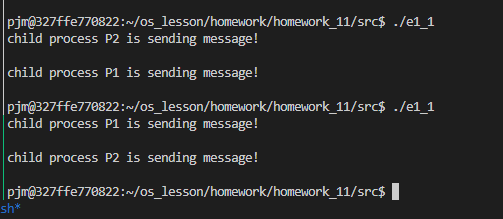
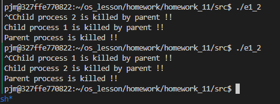
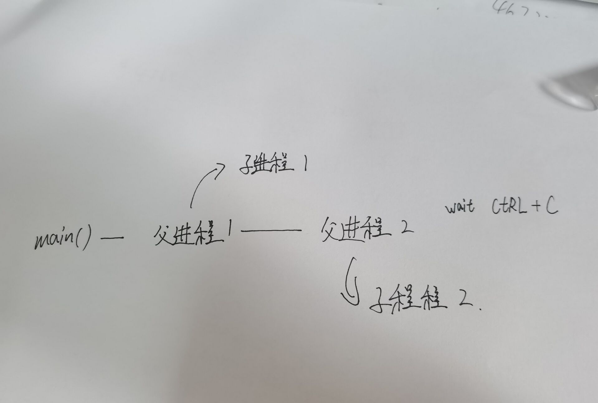

## e1_1
```C
// author: 潘江明
// time: 2022/5/6
// 生成两个子进程，用同一管道进行信息通信
// e1_1

/*
 * lockf(fd, mode, size)
 * fd是文件描述字；
 * mode是锁定方式，mode=1表示加锁，mode=0表示解锁；
 * size是指定文件fd的指定区域，用0表示从当前位置到文件结尾。
 */

#include <stdio.h>
#include <sys/types.h>
#include <sys/wait.h>
#include <unistd.h>
#include <stdlib.h>

void main()
{
    int i, r, p1, p2, p3, fd[2];
    char buf[50], s[50];

    pipe(fd); // 管道

    while ((p1 = fork()) == -1)
        ; // create child process P1

    if (p1 == 0)
    {
        lockf(fd[1], 1, 0);
        sprintf(buf, "child process P1 is sending message!\n");
        write(fd[1], buf, 50);
        lockf(fd[1], 0, 0);
        exit(0);
    }
    else
    {
        while ((p2 = fork()) == -1)
            ; // create child process P2

        if (p2 == 0)
        {
            lockf(fd[1], 1, 0);
            sprintf(buf, "child process P2 is sending message!\n");
            write(fd[1], buf, 50);
            lockf(fd[1], 0, 0);
            exit(0);
        }
        else
        {
            wait(0);
            if (r = read(fd[0], s, 50) == -1)
                printf("can't read pipe\n");
            else
                printf("%s\n", s);

            wait(0);
            if (r = read(fd[0], s, 50) == -1)
                printf("can't read pipe\n");
            else
                printf("%s\n", s);

            exit(0);
        }
    }
}
```

运行结果



## e1_2
```cpp
// author: 潘江明
// time: 2022/5/6
// 通过signal()捕捉CTRL+C来中断两个子进程，最后中断父进程
// e1_2

#include <stdio.h>
#include <sys/types.h>
#include <signal.h>
#include <unistd.h>
#include <stdlib.h>
#include <wait.h>

int wait_flag;

void stop()
{
    wait_flag = 0;
}

int main()
{
    int pid1, pid2;
    wait_flag = 1;
    signal(SIGINT, stop);   // 按CTRL+C后，执行stop()函数

    while ((pid1 = fork()) == -1)
        ;

    if (pid1 > 0)
    {
        while ((pid2 = fork()) == -1)
            ;
        if (pid2 > 0)
        {
            wait_flag = 1;
            while (wait_flag == 1)
                ;   // 等待CTRL+C，wait_flag=0退出循环
            kill(pid1, SIGUSR1);    // 向pid1发送SIGUSR1信号
            kill(pid2, SIGUSR2);    // 向pid2发送SIGUSR2信号
            wait(0);    // 等待子进程
            wait(0);    // 等待子进程
            printf("Parent process is killed !!\n");
            exit(0);
        }
        else
        {
            wait_flag = 1;
            signal(SIGUSR2, stop);
            while (wait_flag == 1)
                ;   // 等待CTRL+C，wait_flag=0退出循环
            printf("Child process 2 is killed by parent !!\n");
            exit(0);
        }
    }
    else
    {
        wait_flag = 1;
        signal(SIGUSR1, stop);
        while (wait_flag == 1)
            ;
        printf("Child process 1 is killed by parent !!\n");
        exit(0);
    }
}
```

运行结果



流程图

