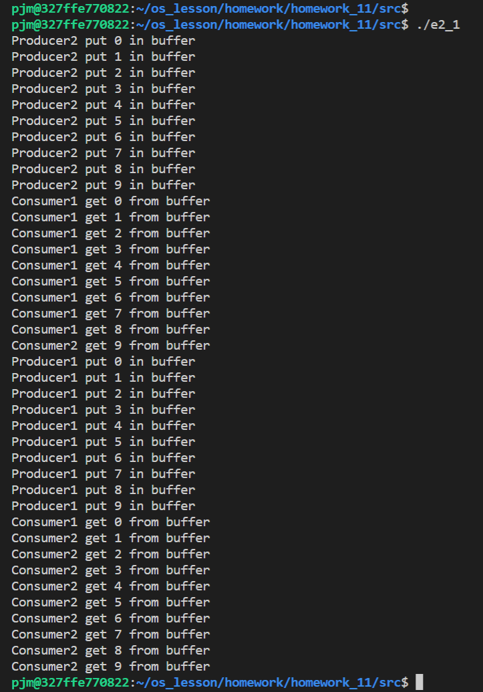
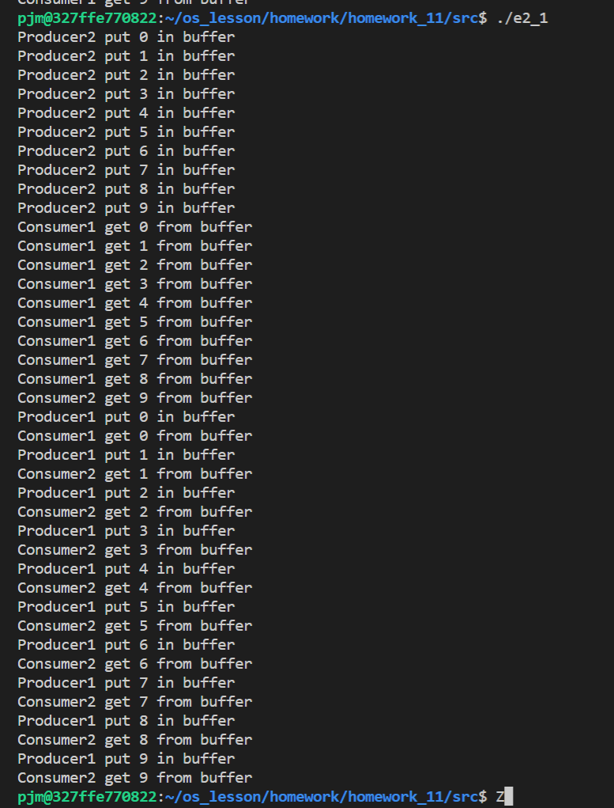

## e2_1
```cpp
// author: 潘江明
// time: 2022/5/9

// 使用POSIX thread库函数pthread_create创建若干个
// (至少2个)生产者线程和1个或若干个消费者线程，
// 利用POSIX线程同步机制互斥锁和条件变量
// 实现生产者线程和消费者线程的同步。
// e2_1

/*
 * int pthread_create(
 *      pthread_t* pid,
 *      const pthread_attr_t* attr,
 *      void*(*func)(void*),
 *      void* arg
 * );
 * *pid : 线程id，传入pthread_t类型的指针，函数返回时会返回线程id
 * attr : 线程属性
 * func : 线程调用的函数
 * arg : 给函数传入的参数
 */

/*
 * int sem_init(
 *    sem_t *sem,
 *    int pshared,
 *    unsigned int value
 * );
 * 该函数初始化由 sem 指向的信号对象，并给它一个初始的整数值 value。
 * pshared 控制信号量的类型，值为 0 代表该信号量用于多线程间的同步，
 * 值如果大于 0 表示可以共享，用于多个相关进程间的同步。
 */

#include <stdio.h>
#include <stdlib.h>
#include <pthread.h>
#include <sys/types.h>
#include <sys/wait.h>
#include <time.h>
#include <semaphore.h>

// 缓冲区最多存放10个数据
#define N 10

// 信号量
sem_t empty, full;

// 缓冲区
int buf[N];

// in: 放入位置
// out: 取出位置
int in, out;

// 互斥锁
pthread_mutex_t mutex;

void *my_consumer(int id)
{
    for (int i = 0; i < 10; i++)
    {
        sem_wait(&full);            // P(full) 即 full--
        pthread_mutex_lock(&mutex); // P(mutex)

        // 消费者工作
        printf("Consumer%d get %d from buffer\n", id, buf[out]);

        buf[out] = -1;

        out++;
        if (out == N)
            out = 0;
        // 结束工作

        pthread_mutex_unlock(&mutex); // V(mutex)
        sem_post(&empty);             // V(empty) 即 empty++
    }
}

void *my_producer(int id)
{
    for (int i = 0; i < 10; i++)
    {
        sem_wait(&empty);           // P(empty) 即 empty--
        pthread_mutex_lock(&mutex); // P(mutex)

        // 生产者工作
        buf[in] = i;
        printf("Producer%d put %d in buffer\n", id, buf[in]);

        in++;
        if (in == N)
            in = 0;
        // 结束工作

        pthread_mutex_unlock(&mutex); // V(mutex)
        sem_post(&full);              // V(full) 即 full++
    }
}

void main()
{
    pthread_t pro1, pro2, con1, con2;

    sem_init(&empty, 0, N); // 初始化empty为N
    sem_init(&full, 0, 0);  // 初始化full为0

    // 创建线程 2个生产者 2个消费者
    pthread_create(&pro1, NULL, (void *)*my_producer, (void *)1);
    pthread_create(&pro2, NULL, (void *)*my_producer, (void *)2);
    pthread_create(&con1, NULL, (void *)*my_consumer, (void *)1);
    pthread_create(&con2, NULL, (void *)*my_consumer, (void *)2);

    // 加入线程
    pthread_join(pro1, NULL);
    pthread_join(pro2, NULL);
    pthread_join(con1, NULL);
    pthread_join(con2, NULL);
}
```

---

### 编译命令
```
gcc e2_1.c -o e2_1 -lpthread
```

### 执行
```
./e2_1
```

### 运行结果
- 结果1
    

- 结果2
    

- 总结：

    在缓冲区满时，生产者等待消费者消费；在缓冲区为空时，消费者等待生产者生产。每个线程之间独立，通过信号量与互斥锁保持线程之间的同步，同时，线程之间异步进行，以随机的方式向前推进。