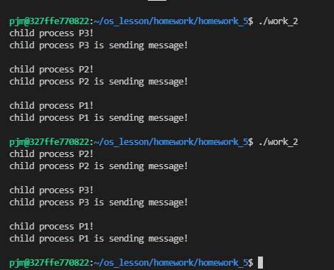

### Code:
```cpp
// author: 潘江明
// time: 2022/3/25
// 生成三个子进程，用同一管道进行信息通信

/*
 * lockf(fd, mode, size)
 * fd是文件描述字；
 * mode是锁定方式，mode=1表示加锁，mode=0表示解锁；
 * size是指定文件fd的指定区域，用0表示从当前位置到文件结尾。
 */

#include <stdio.h>

void main()
{
    int i, r, p1, p2, p3, fd[2];
    char buf[50], s[50];

    pipe(fd); // 管道

    while ((p1 = fork()) == -1)
        ; // create child process P1

    if (p1 == 0)
    {
        lockf(fd[1], 1, 0);
        sprintf(buf, "child process P1 is sending message!\n");
        printf("child process P1!\n");
        write(fd[1], buf, 50);
        lockf(fd[1], 0, 0);
        exit(0);
    }
    else
    {
        while ((p2 = fork()) == -1)
            ; // create child process P2

        if (p2 == 0)
        {
            lockf(fd[1], 1, 0);
            sprintf(buf, "child process P2 is sending message!\n");
            printf("child process P2!\n");
            write(fd[1], buf, 50);
            lockf(fd[1], 0, 0);
            exit(0);
        }
        else
        {
            while ((p3 = fork()) == -1)
                ; // create child process P3

            if (p3 == 0)
            {
                lockf(fd[1], 1, 0);
                sprintf(buf, "child process P3 is sending message!\n");
                printf("child process P3!\n");
                write(fd[1], buf, 50);
                lockf(fd[1], 0, 0);
                exit(0);
            }

            wait(0);
            if (r = read(fd[0], s, 50) == -1)
                printf("can't read pipe\n");
            else
                printf("%s\n", s);

            wait(0);
            if (r = read(fd[0], s, 50) == -1)
                printf("can't read pipe\n");
            else
                printf("%s\n", s);

            wait(0);
            if (r = read(fd[0], s, 50) == -1)
                printf("can't read pipe\n");
            else
                printf("%s\n", s);

            exit(0);
        }
    }
}
```

#### 编译：


#### 运行结果：

